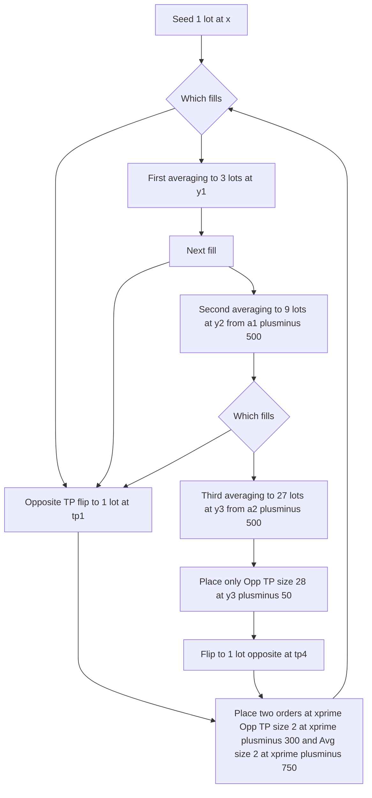

## Haider Strategy — Formal Specification (BTCUSD Futures)

This document formalizes the strategy so both humans and AI agents can implement it unambiguously.

### 1) Objective and High‑level Invariant

- At all times, exactly one open position exists and up to two open orders are maintained to enforce one of:
	- Take‑profit + Flip: close the current position and open a 1‑lot position in the opposite direction, or
	- Averaging: increase exposure in the same direction to improve the average entry price.

Base lot: 1 lot = 0.001 BTC. Quantities below are in lots unless stated otherwise.

### 2) Parameters and Rules

- Initial position: 1 lot in either LONG (+) or SHORT (−) at entry price x.
- Opposite‑direction TP order size: current_open_lots + 1.
	- Rationale: close all current lots and open 1 lot in the opposite direction (flip).
- Same‑direction averaging order size: 2 × current_open_lots.
- Price offsets (absolute USD points) — FIXED:
	- TP after seed (1 lot): 300
	- TP after 1st averaging (3 lots): 200
	- TP after 2nd averaging (9 lots): 100
	- TP after 3rd averaging (27 lots): 50
	- 1st averaging distance (from entry x): 750
	- 2nd averaging distance (from the 1st averaging price a₁): 500
	- 3rd averaging distance (from the 2nd averaging price a₂): 500
- Averaging cap: Stop after the 3rd averaging (max open lots = 27). No 4th averaging.

Direction conventions for prices:
- If current position is LONG at entry x:
	- Opposite‑direction TP order is a SHORT at x + TP_OFFSET.
	- Same‑direction averaging order is a LONG at x − AVG_DISTANCE (for 1st averaging), then at (first_avg_price − 500) for 2nd averaging.
- If current position is SHORT at entry x: mirror the above (signs inverted).

### 3) State Model

We model states by (side, open_lots):
- Seed: (LONG, 1) or (SHORT, 1) at entry x.
- After 1st averaging: (LONG, 3) or (SHORT, 3) at avg price y₁.
- After 2nd averaging: (LONG, 9) or (SHORT, 9) at avg price y₂.
- After 3rd averaging: (LONG, 27) or (SHORT, 27) at avg price y₃.

Let lots be in {1, 3, 9, 27}. Let side ∈ {LONG, SHORT}.

Always maintain orders according to the current state:
1. For lots = 1 at entry x:
	 - Opposite TP/Flip: size = 2, price = x ± 300 toward opposite direction.
	 - Same‑dir avg (1st averaging): size = 2, price = x ∓ 750.
2. For lots = 3 at avg y₁:
	 - Opposite TP/Flip: size = 4, price = y₁ ± 200.
	 - Same‑dir avg (2nd averaging): size = 6, price = first_avg_price ∓ 500.
3. For lots = 9 at avg y₂:
	 - Opposite TP/Flip: size = 10, price = y₂ ± 100.
	 - Same‑dir avg (3rd averaging): size = 18, price = second_avg_price ∓ 500.
4. For lots = 27 at avg y₃:
	 - Only Opposite TP/Flip: size = 28, price = y₃ ± 50. Cancel any other order.

Signs: “±” means add for LONG (upwards), subtract for SHORT (downwards). “∓” is the opposite.

### 4) Price and Average Calculations

- First averaging (from 1 to 3 lots):
	- LONG example: place 2 lots at a₁ = x − 750. If filled, new avg y₁ = (x × 1 + a₁ × 2) / 3.
	- SHORT example: place 2 lots at a₁ = x + 750. If filled, new avg y₁ = (x × 1 + a₁ × 2) / 3.

- Second averaging (from 3 to 9 lots):
	- LONG example: first_avg_price = a₁. Place 6 lots at a₂ = a₁ − 500. If filled, new avg y₂ = (y₁ × 3 + a₂ × 6) / 9.
	- SHORT example: first_avg_price = a₁. Place 6 lots at a₂ = a₁ + 500. If filled, new avg y₂ = (y₁ × 3 + a₂ × 6) / 9.

- Third averaging (from 9 to 27 lots):
	- LONG example: second_avg_price = a₂. Place 18 lots at a₃ = a₂ − 500. If filled, new avg y₃ = (y₂ × 9 + a₃ × 18) / 27.
	- SHORT example: second_avg_price = a₂. Place 18 lots at a₃ = a₂ + 500. If filled, new avg y₃ = (y₂ × 9 + a₃ × 18) / 27.

- Opposite TP/Flip (general):
	- Size = current_open_lots + 1. Price = current_avg_price ± TP_OFFSET.
	- On fill: close current_open_lots and open a new 1‑lot position in the opposite direction at the TP price (becomes new entry x’).

### 5) Invariant Management and Order Lifecycle

At any time, there should be exactly two live orders except when transitioning after a fill:
- When one order fills, immediately cancel the other outstanding order before placing new ones per the new state.
- After reaching 27 lots, maintain only one opposite TP/Flip order (size 28) until it fills; do not place any more averaging orders.

Partial fills policy (CONFIRMED):
- Cancel and recreate the paired order rather than resizing in place (Delta UI limitations make resizing unreliable). Keep the end state invariant intact.

Fees/slippage buffer: None. Place prices exactly at specified levels.

Rounding rules and increments:
- Quantity lots: 1 lot = 0.001 BTC. Quantities are integers in lots (1, 2, 4, 6, 9, 10, 18, 27, 28 as specified by transitions).
- Price tick: assume 1 USD tick for BTCUSD until exchange UI indicates otherwise; if a validation error occurs, round to the nearest valid tick. All examples use integer USD levels.

### 6) Canonical Scenarios

Seed example:
1. Position: LONG 1 lot at x = 100000.
2. Opposite TP/Flip: SHORT 2 at 100300 (= x + 300). On fill: close 1, open SHORT 1 at 100300.
3. Same‑dir avg: LONG 2 at 99250 (= x − 750). On fill: position becomes LONG 3 at y₁ = (100000 + 2×99250)/3 = 99500.

Branch A (CASE 1 in txt): TP/Flip fills before first averaging
4. SHORT 2 @ 100300 fills → New position: SHORT 1 @ 100300. Cancel the unfilled LONG 2 @ 99250.
5. Place two new orders relative to 100300:
	 - Opposite TP/Flip: LONG 2 @ 100000 (= 100300 − 300)
	 - Same‑dir avg: SHORT 2 @ 101050 (= 100300 + 750)
	 Then repeat logic at lots=1 in SHORT.

Branch B (CASE 2 in txt): First averaging fills
4. LONG 2 @ 99250 fills → Position: LONG 3 @ 99500. Cancel the unfilled SHORT 2 @ 100300.
5. Place two new orders:
	 - Opposite TP/Flip: SHORT 4 @ 99700 (= 99500 + 200)
	 - Same‑dir avg: LONG 6 @ 98750 (= 99250 − 500), i.e., 500 below the first averaging price.
6. Two sub‑branches:
	 - B1: Opposite TP/Flip (SHORT 4 @ 99700) fills → Position flips to SHORT 1 @ 99700; cancel LONG 6 @ 98750; place SHORT‑state seed orders (mirror of initial seed).
	 - B2: Second averaging (LONG 6 @ 98750) fills → Position: LONG 9 @ 99000 (= (99500×3 + 98750×6)/9). Cancel SHORT 4 @ 99700. Now place two orders:
		   - Opposite TP/Flip: SHORT 10 @ 99100 (= 99000 + 100)
		   - Same‑dir avg (3rd averaging): LONG 18 @ 98250 (= 98750 - 500)
7. From 9-lot state, two sub‑branches:
	 - B2a: Opposite TP/Flip (SHORT 10 @ 99100) fills → Position flips to SHORT 1 @ 99100; cancel LONG 18 @ 98250; place SHORT‑state seed orders.
	 - B2b: Third averaging (LONG 18 @ 98250) fills → Position: LONG 27 @ 98583.33 (= (99000×9 + 98250×18)/27). Cancel SHORT 10 @ 99100. Now maintain only one order:
		   - Opposite TP/Flip ONLY: SHORT 28 @ 98633.33 (= 98583.33 + 50). On fill → Position flips to SHORT 1 @ 98633.33, and immediately resume the seed pattern.

All SHORT scenarios mirror the LONG examples with signs inverted.

### 7) Flowchart



Legend: “±” means toward TP side; “∓” means away (averaging side). Use mirrors for SHORT.

### 8) Pseudocode (deterministic loop)

```
state = { side: LONG|SHORT, lots: 1|3|9, entry: x, first_avg_price?: a1 }
while true:
		observe position, open orders
		ensure invariant: correct orders exist for state; cancel any extraneous or stale ones

	if lots == 1:
		place opposite(size=2, price=x±300)
		place avg1(size=2, price=x∓750)
			if opposite filled:
			flip to 1 lot opposite @ price
				cancel avg1 (if any partials of avg1 exist, cancel/recreate as needed)
		elif avg1 filled:
			lots=3; entry=y1=(x+2*a1)/3; first_avg_price=a1; cancel opposite

	elif lots == 3:
		place opposite(size=4, price=entry±200)
		place avg2(size=6, price=first_avg_price∓500)
			if opposite filled:
			flip to 1 lot opposite @ price
				cancel avg2 (handle any partials by cancel/recreate)
			lots=1; entry=price; unset first_avg_price
		elif avg2 filled:
			lots=9; entry=y2=(entry*3 + a2*6)/9; second_avg_price=a2; cancel opposite

	elif lots == 9:
		place opposite(size=10, price=entry±100)
		place avg3(size=18, price=second_avg_price∓500)
		if opposite filled:
			flip to 1 lot opposite @ price
			cancel avg3 (handle any partials by cancel/recreate)
			lots=1; entry=price; unset first_avg_price, second_avg_price
		elif avg3 filled:
			lots=27; entry=y3=(entry*9 + a3*18)/27; cancel opposite

	elif lots == 27:
		place opposite(size=28, price=entry±50)
		cancel any other orders
		if opposite filled:
			flip to 1 lot opposite @ price
			lots=1; entry=price; unset first_avg_price, second_avg_price
```

### 9) Operational Notes

- Always cancel the non‑filled paired order immediately after one order fills before placing new ones.
- Use limit orders; ensure price formatting and tick sizes are valid for the instrument.
- Ensure we only target BTCUSD and ignore other symbols.
- Log every state transition and order placement.

### 10) Confirmed Policies

- Offsets fixed: TP = 300→200→100→50; averaging distances = 750 then 500 then 500 (regardless of volatility).
- Second averaging anchor: 500 points from the first averaging price (a₁), not from the 3‑lot average y₁.
- Third averaging anchor: 500 points from the second averaging price (a₂), not from the 9‑lot average y₂.
- Partial fills: cancel and recreate paired orders; no in‑place resizing.
- Fees/slippage: no additional buffer; use exact levels.
- After 28‑lot TP fill at 27 lots: immediately resume seed pattern on the flipped 1‑lot position.

Open items (operational):
- Confirm actual tick size constraints from Delta UI at runtime; currently assume 1 USD and adjust if rejected.
